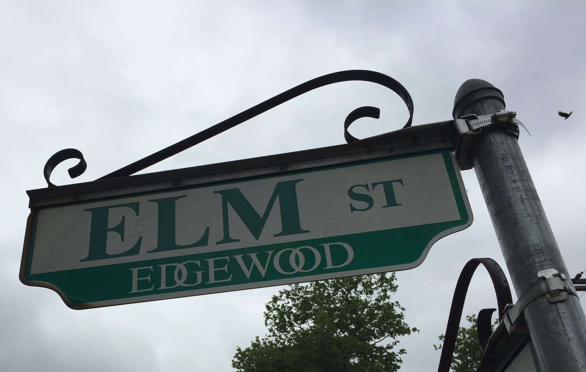

% Elm
% Functional Programming for
% More Functional Programmers

## Elm

{ width=30% }

## Why Elm?

## Developer Friendly

"A delightful language for reliable web programming"

## Speed

##

- Functional programming
- How Elm did FP right for web development
- Elm Architecture
- Code

## Predecessors

- λ-Calculus
- Lisp
- ML
- Haskell

## Functional Programming

- Immutable state
- Pure functions
- Higher order functions

## Functional Programming

- Composition
- Currying

# Elm

## Elm Generates

- JavaScript
- HTML
- CSS

## Elm Does Not Generate

- null

## No more

~~~~~~~
Uncaught TypeError: Cannot read property 'x' of undefined
~~~~~~~

## Just Maybe

~~~~~~~
type Maybe something
   = Just something
   | Nothing
~~~~~~~

# Elm Architecture

##

##

~~~~~~~
beginnerProgram :
   { model : model
   , view : model -> Html msg
   , update : msg -> model -> model }
    -> Program Never model msg
~~~~~~~

## Model

~~~~~~~
type alias Model = Int
~~~~~~~

## A More Complex Model

~~~~~~~
type alias Model =
    { score : Int
    , player : User
    , opponent : User
    , board : GameBoard
    }
~~~~~~~

## Msg

~~~~~~~
type Msg = Increment
         | Decrement
~~~~~~~

## View

~~~~~~~
// From evancz/elm-architecture-tutorial

view : Model -> Html Msg
view model =
  div []
    [ button [ onClick Decrement ] [ text "-" ]
    , div [] [ text (toString model) ]
    , button [ onClick Increment ] [ text "+" ]
    ]
~~~~~~~

## Update

~~~~~~~
// From evancz/elm-architecture-tutorial

update : Msg -> Model -> Model
update msg model =
  case msg of
    Increment ->
      model + 1

    Decrement ->
      model - 1
~~~~~~~

# Elm Architecture

##

##

~~~~~~~
program :
  { init : (model, Cmd msg)
  , update : msg -> model -> (model, Cmd msg)
  , subscriptions : model -> Sub msg
  , view : model -> Html msg }
    -> Program Never model msg
~~~~~~~

## Update

~~~~~~~
update : Msg -> Model -> ( Model, Cmd Msg )
~~~~~~~

## Subscriptions

Input from the platform

- Mouse or keyboard
- Browser changes
- Websockets

##

~~~~~~~
subscriptions : Model -> Sub Msg
subscriptions model =
    Sub.batch
        [ Mouse.clicks MouseMsg
        , Keyboard.downs KeyMsg
        ]
~~~~~~~

## Commands

Make requests to the platform

- HTTP request
- Save to local storage
- Generate a random number

## Add Initial Interaction

Starting flags from javascript

~~~~~~~
programWithFlags :
  { init : flags -> (model, Cmd msg)
  , update : msg -> model -> (model, Cmd msg)
  , subscriptions : model -> Sub msg
  , view : model -> Html msg }
    -> Program flags model msg
~~~~~~~

# Elm Compiler

## Helpful messages

- [Spelling](https://ellie-app.com/3r2QC9dHTnqa1/0)
- [Match branch types](https://ellie-app.com/3r2QC9dHTnqa1/1)
- [Missing branch](https://ellie-app.com/3r2QC9dHTnqa1/2)

## Compiler Driven Development

- [Increment & decrement](https://ellie-app.com/3r2QC9dHTnqa1/3)

# Packages and Versions

## Packages

- [Published packages](http://package.elm-lang.org/)
- [Function search](http://klaftertief.github.io/elm-search/)

## elm-package.json

~~~~~~~
…
    "version": "1.0.0",
…
    "dependencies": {
        "elm-lang/core": "5.0.0 <= v < 6.0.0",
        "elm-lang/html": "2.0.0 <= v < 3.0.0",
        "elm-lang/svg": "2.0.0 <= v < 3.0.0"
    },
    "elm-version": "0.18.0 <= v < 0.19.0"
…
~~~~~~~

## Semantic Versioning

Enforced for published packages

## Patch

~~~~~~~
> elm-package diff elm-lang/core 5.1.0 5.1.1
Comparing elm-lang/core 5.1.0 to 5.1.1...
This is a PATCH change.
~~~~~~~

## Minor

~~~~~~~
> elm-package diff elm-lang/core 5.0.0 5.1.1
Comparing elm-lang/core 5.0.0 to 5.1.1...
This is a MINOR change.

------ Changes to module List - MINOR ------

    Added:
        singleton : a -> List a
~~~~~~~

## Major

~~~~~~~
> elm-package diff elm-lang/navigation 1.0.0 2.1.0
Comparing elm-lang/navigation 1.0.0 to 2.1.0...
This is a MAJOR change.
------ Changes to module Navigation - MAJOR ------
   Added:
       load : String -> Platform.Cmd.Cmd msg
   Removed:
       type Parser a
       makeParser : (Navigation.Location -> a) -> Navigation.Parser a
   Changed:
     - program : Navigation.Parser data -> { init : data -> (model, Platform.Cmd.Cmd msg),
                                             update : msg -> model -> (model, Platform.Cmd.Cmd msg),
                                             urlUpdate : data -> model -> (model, Platform.Cmd.Cmd msg),
                                             view : model -> Html.Html msg,
                                             subscriptions : model -> Platform.Sub.Sub msg
                                           } -> Platform.Program Basics.Never
~~~~~~~

# Time Traveling Debugger

##

[Counter](http://localhost:8000/)

[Game](http://localhost:3000/)

##

# Questions?
